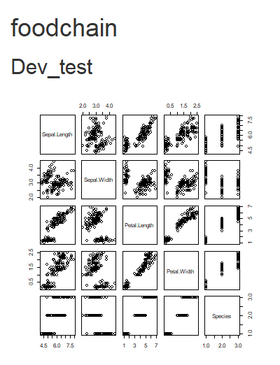

<!-- README.md is generated from README.Rmd. Please edit that file -->

# foodchain

<!-- badges: start -->
<!-- badges: end -->

The goal of foodchain is to …

## Installation

You can install the released version of foodchain from
[CRAN](https://CRAN.R-project.org) with:

``` r
install.packages("foodchain")
```

And the development version from [GitHub](https://github.com/) with:

``` r
# install.packages("devtools")
devtools::install_github("StoianAndrei/foodchain")
```

## Example

This is a basic example which shows you how to solve a common problem:

``` r
library(foodchain)
## basic example code
```

What is special about using `README.Rmd` instead of just `README.md`?
You can include R chunks like so:

``` r
run_app()
#> Loading required package: shiny
#> 
#> Listening on http://127.0.0.1:6605
```



You’ll still need to render `README.Rmd` regularly, to keep `README.md`
up-to-date. `devtools::build_readme()` is handy for this. You could also
use GitHub Actions to re-render `README.Rmd` every time you push. An
example workflow can be found here:
<https://github.com/r-lib/actions/tree/master/examples>.

You can also embed plots, for example:


In that case, don’t forget to commit and push the resulting figure
files, so they display on GitHub and CRAN.

## Code of Conduct

Please note that the foodchain project is released with a [Contributor
Code of
Conduct](https://contributor-covenant.org/version/2/0/CODE_OF_CONDUCT.html).
By contributing to this project, you agree to abide by its terms.
